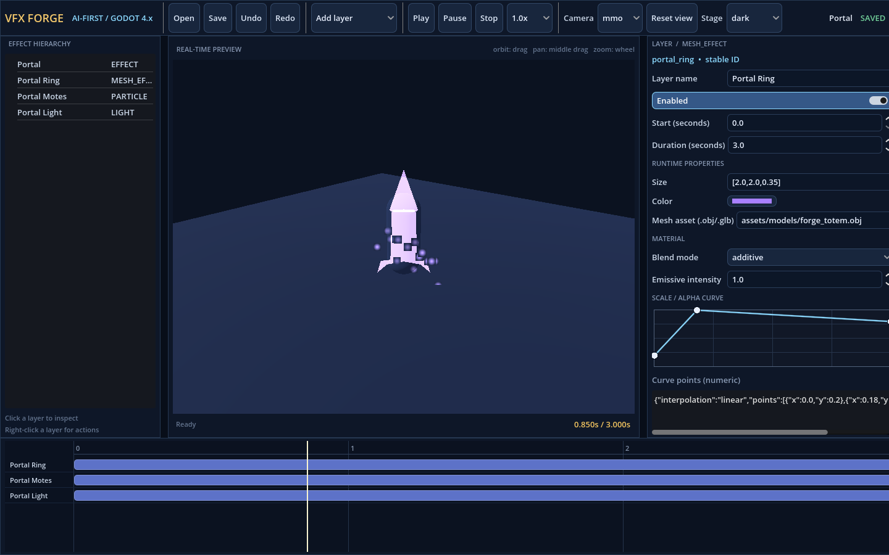

# VFX Forge

[](https://godotengine.org/)
[](LICENSE)
[](COMMERCIAL.md)
[](CONTRIBUTING.md)
[](#verification)

**Community-built Godot tooling for authoring, validating, previewing, and exporting real-time VFX.**

VFX Forge is a standalone, offline, AI-first real-time VFX authoring tool for Godot 4.x. The authoritative project is a versioned JSON document. The Godot editor, runtime preview, CLI, deterministic PNG renderer, validation engine, and exporter all consume that same document.



## Built for Enigma

This tool was extracted from the content pipeline for **Enigma**, my Godot 3D MMO project. Combat impacts, ability telegraphs, ambient world effects, and weapon trails all need the same authoring contract, validation, and export path — VFX Forge is the shared studio that makes that repeatable.

The repo has **no runtime dependency** on the game itself: it ships as a standalone studio with its own CLI, schema, validation, GUI, and export pipeline. If you are building a Godot game with lots of real-time effects, you can adopt VFX Forge without touching Enigma.

Related open tooling from the same ecosystem: [Icon Studio](https://github.com/Superlapie/IconStudioEnigma) for consistent inventory art, shop thumbnails, and UI imagery.

## Community project

VFX Forge is intentionally open. I want this to become a **badass community-built tool**, not a private pipeline script.

- **Good pull requests get reviewed.** See [CONTRIBUTING.md](CONTRIBUTING.md) for scope, quality gate expectations, and first-contribution ideas.
- **Discussions are open** for layer design, integration questions, and roadmap ideas: [GitHub Discussions](https://github.com/Superlapie/VFXForgeEnigma/discussions).
- **Issues welcome** for reproducible bugs and focused feature requests.

If VFX Forge saves you time on your Godot project, a star, an example effect, or a docs fix helps others find it too.

## What is included

- native Godot runtime layers for particles, mesh particles, sprites, lights, trails, beams, decals, mesh effects, markers, and child effects;
- stable layer IDs, schema migration, atomic saves, recovery backups, curves, gradients, dependencies, timelines, budgets, and validation;
- a professional Godot editor with hierarchy, 3D preview stage, inspector, curve/gradient widgets, timeline scrubbing, camera/background presets, undo/redo, autosave, and keyboard shortcuts;
- a deterministic CLI with structured JSON output, batch validation/export/render/migrate/inspect, semantic diff, self-describing schema help, and eight authored examples;
- self-contained Godot export with relative texture/model dependencies, manifest hashes, generated scoped shader, and a clean-project instantiate smoke test that verifies imported custom mesh geometry.

## Quick start

Godot 4.7.2-stable was used for the verified build. The application targets Godot 4.x and does not require cloud services.

```bash
python3 -m venv .venv
.venv/bin/pip install -e .
. .venv/bin/activate
vfxforge --version
vfxforge preset create arcane_impact --output /tmp/arcane_impact.vfx.json
vfxforge validate /tmp/arcane_impact.vfx.json --json
godot --path . --editor
```

Without installing the package, use `./bin/vfxforge` in place of `vfxforge`.

## Useful commands

Service workflow (preferred for production effect generation):

```bash
vfxforge plan --request examples/requests/fire_impact.vfxrequest.json --policy default --json
vfxforge forge --request examples/requests/boss_line_sweep.vfxrequest.json --policy enigma --workspace build/service --json
vfxforge recipes list --json
vfxforge policies show enigma --json
```

Expert/manual document editing:

```bash
vfxforge create effects/arcane_impact.vfx.json --name "Arcane Impact" --duration 1.5
vfxforge add-layer effects/arcane_impact.vfx.json --type particle --id sparks
vfxforge set effects/arcane_impact.vfx.json layers.sparks.amount=64
vfxforge inspect effects/arcane_impact.vfx.json --json
vfxforge validate effects/arcane_impact.vfx.json --json
vfxforge render-preview effects/arcane_impact.vfx.json --time 0.8 --camera mmo --output preview.png
vfxforge export effects/arcane_impact.vfx.json --output build/ArcaneImpact
vfxforge diff old.json new.json --json
```

All commands accept `--json`. Machine output has stable success, command, errors, warnings, and artifacts keys. Exit code 0 means success, 1 validation failure, 2 usage/file failure, and 3 preview/export artifact failure.

## Verification

```bash
./scripts/quality-gate
```

The gate runs focused Python model/CLI/renderer tests, user-facing CLI + GUI E2E tests with a real OBJ model, validates and renders all examples, exports them, launches the Godot project headlessly, and runs Godot clean-project export smoke tests when Godot 4 is available. Generated output goes under ignored `build/quality`. See [docs/E2E_TESTING.md](docs/E2E_TESTING.md).

## Documentation

- [Quickstart](docs/QUICKSTART.md)
- [AI / machine workflow](docs/AI_WORKFLOW.md)
- [CLI reference](docs/CLI_REFERENCE.md)
- [Layer reference](docs/LAYER_REFERENCE.md)
- [Contributing](CONTRIBUTING.md)
- [Commercial licensing](COMMERCIAL.md)

Read [docs/QUICKSTART.md](docs/QUICKSTART.md), [docs/AI_WORKFLOW.md](docs/AI_WORKFLOW.md), and [AGENTS.md](AGENTS.md) for the working contract.

## License

VFX Forge uses **dual licensing**:

- **Noncommercial use** — free under the [PolyForm Noncommercial License 1.0.0](LICENSE). You can read, fork, contribute, learn from, and use the project for personal, hobby, educational, and other noncommercial purposes.
- **Commercial use** — requires a separate paid license. See [COMMERCIAL.md](COMMERCIAL.md) for what counts as commercial use and how to contact me.

If you want to ship a commercial game, product, service, or client deliverable with VFX Forge in the pipeline, get a commercial license first.
